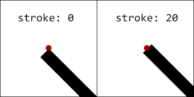
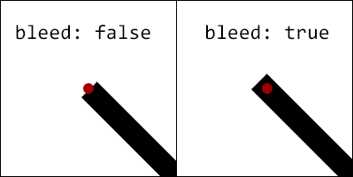

html-lines
==========

Draw a line using an HTML element between two existing elements. Lines can easily be made to work responsively when attaching the `redraw` method to the window.resize event. Use CSS to control line styles and animation. Use the LINES API to manipulate the lines.

LINES
-----
This is the global object created when loading html-lines.js.
```html
<script src="html-lines.js"></script>
```

If using CommonJS, **LINES** would be created by requiring.
```js
var LINES = require('html-lines');
```

### LINES.setOptions
@param - {Object}  
Change the default options.
```js
LINES.setOptions({
    lineElementType: {String},
    nameAttribute: {String},
    stateAttribute: {String}
});

// defaults
{
    lineElementType: 'div',
    nameAttribute: 'data-line',
    stateAttribute: 'data-line-state'
}
```

### LINES.createAnchor
@param - {Object}  
@return - {Object} instance of Anchor
```js
var anchor = LINES.createAnchor({
    el: {HTMLElement or querySelector String},
    xOrigin: {'center' or 'left' or 'right' or Number}, // any number is multiplied by the width
    yOrigin: {'center' or 'top' or 'left' or Number}, // any number is multiplied by the height
    xOffset: {Number},
    yOffset: {Number}
});

// defaults
{
    el: document.body,
    xOffset: 0,
    yOffset: 0,
    xOrigin: 'center',
    yOrigin: 'center'
}
```
*Anchors don't add anything to the DOM.*

### LINES.createLine
@param - {Object} instance of Anchor  
@param - {Object} instance of Anchor  
@param - {Object}  
@return - {Object} instance of Line
```js
LINES.createLine(anchor1, anchor2, {
    name: {String},
    state: {String},
    stroke: {Number},
    bleed: {Boolean}
});

// defaults
{
    name: '',
    state: '',
    stroke: 1,
    bleed: false
}
```

#### name and state
These are basically for CSS hooks.

#### stroke
The stroke or height of the line element needs to be set in pixels to accuratly draw a line.  


#### bleed
Bleed is used to extend lines half the width of the stroke on each end.  


### LINES.redraw
Recalculates anchor positions and changes line position, size and angle.
```js
LINES.redraw();
```

### LINES.getAnchors
Returns a copy of the anchors array.  
@return - {Array}
```js
var anchors = LINES.getAnchors();
```

### LINES.getLines
Returns a copy of the lines array.  
@return - {Array}
```js
var lines = LINES.getLines();
```

### LINES.destroyAll
```js
LINES.destroyAll();
```

Instance of Anchor
------------------

```js
var anchor = LINES.createAnchor(...);
```

### anchor.offset
Recalculate the position of an anchor. Typically do this before calling `line.redraw()`.
```js
anchor.offset();
```

### anchor.destory
```js
anchor.destory();
```
*Any lines attached to this anchor will also be destoryed.*

Instance of Line
----------------

```js
var line = LINES.createLine(...);
```

### line.redraw
@return - {Object}
```js
var dimensions = line.redraw();

console.log(dimensions.width); // {Number} length in pixels of the line
console.log(dimensions.angle); // {Number} angle in radians of the line
```

### line.stroke
Assigns a new stroke size if passing a number and always returns the stroke size.  
@param - {Number}  
@return - {Number}
```js
line.stroke(3);
// or
console.log(line.stroke()); // 3
```

### line.name
Assigns a new name if passing a string and always returns the line name.  
@param - {String}  
@return - {String}
```js
line.name('newName');
// or
console.log(line.name()); // 'newName'
```

### line.state
Assigns a new state if passing a string and always returns the line state.  
@param - {String}  
@return - {String}
```js
line.state('newState');
// or
console.log(line.state()); // 'newState'
```

### line.destroy
This is automatically called when either of the line's anchors are destroyed.
```js
line.destroy();
```
*This should rarely be used since lines are destroyed when anchors are destroyed but not vice versa.*

*ISC license*
